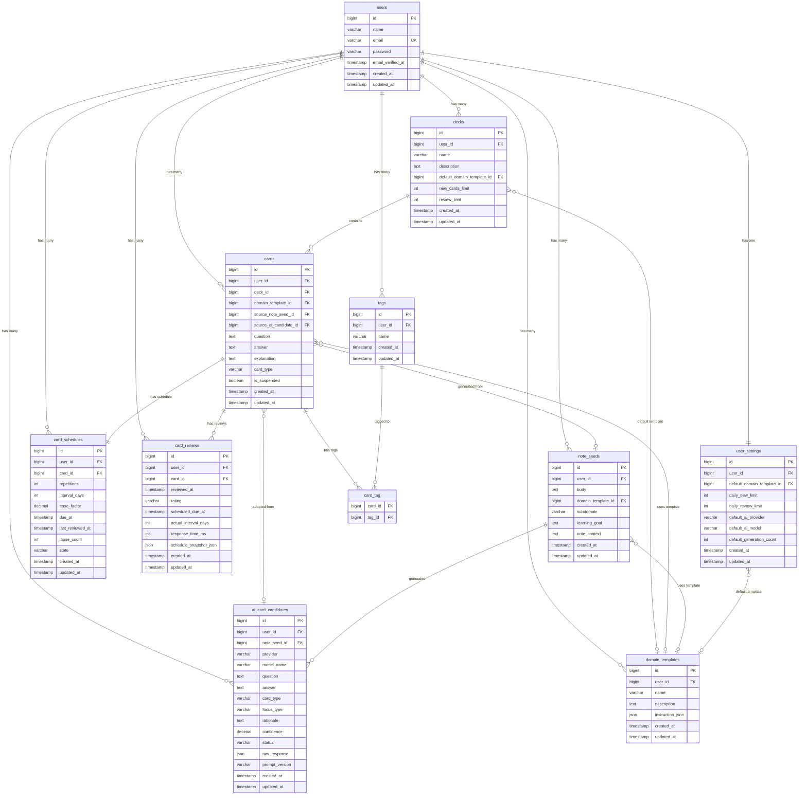

# データベース ER図 & テーブル定義

## ER図 (Mermaid)



---

## テーブル定義詳細

### users

| カラム | 型 | 制約 | 説明 |
|--------|------|------|------|
| id | BIGINT UNSIGNED | PK, AUTO_INCREMENT | |
| name | VARCHAR(255) | NOT NULL | ユーザー名 |
| email | VARCHAR(255) | NOT NULL, UNIQUE | メールアドレス |
| password | VARCHAR(255) | NOT NULL | ハッシュ化パスワード |
| email_verified_at | TIMESTAMP | NULLABLE | メール認証日時 |
| created_at | TIMESTAMP | | |
| updated_at | TIMESTAMP | | |

### decks

| カラム | 型 | 制約 | 説明 |
|--------|------|------|------|
| id | BIGINT UNSIGNED | PK, AUTO_INCREMENT | |
| user_id | BIGINT UNSIGNED | FK(users.id), NOT NULL | 所有者 |
| name | VARCHAR(255) | NOT NULL | デッキ名 |
| description | TEXT | NULLABLE | 説明 |
| default_domain_template_id | BIGINT UNSIGNED | FK(domain_templates.id), NULLABLE | 既定テンプレート |
| new_cards_limit | INT UNSIGNED | DEFAULT 20 | 新規カード出題上限/日 |
| review_limit | INT UNSIGNED | NULLABLE | 復習上限/日 |
| created_at | TIMESTAMP | | |
| updated_at | TIMESTAMP | | |

**INDEX**: `idx_decks_user_id` (user_id)

### cards

| カラム | 型 | 制約 | 説明 |
|--------|------|------|------|
| id | BIGINT UNSIGNED | PK, AUTO_INCREMENT | |
| user_id | BIGINT UNSIGNED | FK(users.id), NOT NULL | 所有者 |
| deck_id | BIGINT UNSIGNED | FK(decks.id), NOT NULL | 所属デッキ |
| domain_template_id | BIGINT UNSIGNED | FK, NULLABLE | 使用テンプレート |
| source_note_seed_id | BIGINT UNSIGNED | FK(note_seeds.id), NULLABLE | 元メモ |
| source_ai_candidate_id | BIGINT UNSIGNED | FK(ai_card_candidates.id), NULLABLE | 元AI候補 |
| question | TEXT | NOT NULL | 問題文 |
| answer | TEXT | NOT NULL | 回答 |
| explanation | TEXT | NULLABLE | 補足説明 |
| card_type | VARCHAR(50) | NOT NULL, DEFAULT 'basic_qa' | カード種別 |
| is_suspended | BOOLEAN | DEFAULT FALSE | 一時停止フラグ |
| created_at | TIMESTAMP | | |
| updated_at | TIMESTAMP | | |

**INDEX**: `idx_cards_user_deck` (user_id, deck_id), `idx_cards_source_note` (source_note_seed_id)

**card_type ENUM値**: `basic_qa`, `comparison`, `practical_case`, `cloze_like`

### tags

| カラム | 型 | 制約 | 説明 |
|--------|------|------|------|
| id | BIGINT UNSIGNED | PK, AUTO_INCREMENT | |
| user_id | BIGINT UNSIGNED | FK(users.id), NOT NULL | 所有者 |
| name | VARCHAR(100) | NOT NULL | タグ名 |
| created_at | TIMESTAMP | | |
| updated_at | TIMESTAMP | | |

**UNIQUE**: `uq_tags_user_name` (user_id, name)

### card_tag (中間テーブル)

| カラム | 型 | 制約 | 説明 |
|--------|------|------|------|
| card_id | BIGINT UNSIGNED | FK(cards.id), NOT NULL | |
| tag_id | BIGINT UNSIGNED | FK(tags.id), NOT NULL | |

**PRIMARY KEY**: (card_id, tag_id)

### note_seeds

| カラム | 型 | 制約 | 説明 |
|--------|------|------|------|
| id | BIGINT UNSIGNED | PK, AUTO_INCREMENT | |
| user_id | BIGINT UNSIGNED | FK(users.id), NOT NULL | 所有者 |
| body | TEXT | NOT NULL | メモ本文 |
| domain_template_id | BIGINT UNSIGNED | FK, NULLABLE | 分野テンプレート |
| subdomain | VARCHAR(255) | NULLABLE | サブ分野 |
| learning_goal | TEXT | NULLABLE | 学習目的 |
| note_context | TEXT | NULLABLE | 補足コンテキスト |
| created_at | TIMESTAMP | | |
| updated_at | TIMESTAMP | | |

**INDEX**: `idx_note_seeds_user_id` (user_id)

### ai_card_candidates

| カラム | 型 | 制約 | 説明 |
|--------|------|------|------|
| id | BIGINT UNSIGNED | PK, AUTO_INCREMENT | |
| user_id | BIGINT UNSIGNED | FK(users.id), NOT NULL | 所有者 |
| note_seed_id | BIGINT UNSIGNED | FK(note_seeds.id), NOT NULL | 元メモ |
| provider | VARCHAR(50) | NOT NULL | AIプロバイダ名 |
| model_name | VARCHAR(100) | NOT NULL | 使用モデル名 |
| question | TEXT | NOT NULL | 生成問題文 |
| answer | TEXT | NOT NULL | 生成回答 |
| card_type | VARCHAR(50) | NOT NULL | カード種別 |
| focus_type | VARCHAR(50) | NULLABLE | 観点タイプ |
| rationale | TEXT | NULLABLE | 生成根拠 |
| confidence | DECIMAL(3,2) | NULLABLE | 信頼度(0.00-1.00) |
| status | VARCHAR(20) | NOT NULL, DEFAULT 'pending' | pending/adopted/rejected |
| raw_response | JSON | NULLABLE | AI生レスポンス |
| prompt_version | VARCHAR(20) | NULLABLE | プロンプトバージョン |
| created_at | TIMESTAMP | | |
| updated_at | TIMESTAMP | | |

**INDEX**: `idx_candidates_note_seed` (note_seed_id), `idx_candidates_status` (status)

### domain_templates

| カラム | 型 | 制約 | 説明 |
|--------|------|------|------|
| id | BIGINT UNSIGNED | PK, AUTO_INCREMENT | |
| user_id | BIGINT UNSIGNED | FK(users.id), NOT NULL | 所有者 |
| name | VARCHAR(255) | NOT NULL | テンプレート名 |
| description | TEXT | NULLABLE | 説明 |
| instruction_json | JSON | NOT NULL | 策問ポリシー定義 |
| created_at | TIMESTAMP | | |
| updated_at | TIMESTAMP | | |

**instruction_json スキーマ例**:
```json
{
  "goal": "Web開発の基礎知識を定着させる",
  "priorities": ["定義を短く問う", "なぜ必要かを問う", "類似概念との違いを問う"],
  "avoid": ["長文回答を求める問い", "Yes/Noだけで答えられる問い"],
  "preferred_card_types": ["basic_qa", "comparison"],
  "answer_style": "1-2文で簡潔に",
  "difficulty_policy": "初学者向け",
  "note_interpretation_policy": "メモにない内容を過剰に補完しない"
}
```

### card_schedules

| カラム | 型 | 制約 | 説明 |
|--------|------|------|------|
| id | BIGINT UNSIGNED | PK, AUTO_INCREMENT | |
| user_id | BIGINT UNSIGNED | FK(users.id), NOT NULL | 所有者 |
| card_id | BIGINT UNSIGNED | FK(cards.id), NOT NULL, UNIQUE | 対象カード |
| repetitions | INT UNSIGNED | NOT NULL, DEFAULT 0 | 連続正答回数 |
| interval_days | INT UNSIGNED | NOT NULL, DEFAULT 0 | 現在の間隔(日) |
| ease_factor | DECIMAL(4,2) | NOT NULL, DEFAULT 2.50 | 容易さ係数 |
| due_at | TIMESTAMP | NOT NULL | 次回出題日 |
| last_reviewed_at | TIMESTAMP | NULLABLE | 最終レビュー日 |
| lapse_count | INT UNSIGNED | NOT NULL, DEFAULT 0 | 忘却回数 |
| state | VARCHAR(20) | NOT NULL, DEFAULT 'new' | new/learning/review/relearning |
| created_at | TIMESTAMP | | |
| updated_at | TIMESTAMP | | |

**INDEX**: `idx_schedules_due` (user_id, due_at), `idx_schedules_card` (card_id) UNIQUE

### card_reviews

| カラム | 型 | 制約 | 説明 |
|--------|------|------|------|
| id | BIGINT UNSIGNED | PK, AUTO_INCREMENT | |
| user_id | BIGINT UNSIGNED | FK(users.id), NOT NULL | 所有者 |
| card_id | BIGINT UNSIGNED | FK(cards.id), NOT NULL | 対象カード |
| reviewed_at | TIMESTAMP | NOT NULL | レビュー実施日時 |
| rating | VARCHAR(10) | NOT NULL | again/hard/good/easy |
| scheduled_due_at | TIMESTAMP | NULLABLE | 予定出題日 |
| actual_interval_days | INT | NULLABLE | 実際の間隔(日) |
| response_time_ms | INT UNSIGNED | NULLABLE | 回答所要時間(ms) |
| schedule_snapshot_json | JSON | NULLABLE | スケジュールスナップショット |
| created_at | TIMESTAMP | | |
| updated_at | TIMESTAMP | | |

**INDEX**: `idx_reviews_user_card` (user_id, card_id), `idx_reviews_date` (reviewed_at)

### user_settings

| カラム | 型 | 制約 | 説明 |
|--------|------|------|------|
| id | BIGINT UNSIGNED | PK, AUTO_INCREMENT | |
| user_id | BIGINT UNSIGNED | FK(users.id), NOT NULL, UNIQUE | 対象ユーザー |
| default_domain_template_id | BIGINT UNSIGNED | FK, NULLABLE | 既定テンプレート |
| daily_new_limit | INT UNSIGNED | DEFAULT 20 | 新規カード上限/日 |
| daily_review_limit | INT UNSIGNED | DEFAULT 100 | 復習上限/日 |
| default_ai_provider | VARCHAR(50) | DEFAULT 'openai' | 既定AIプロバイダ |
| default_ai_model | VARCHAR(100) | DEFAULT 'gpt-4o-mini' | 既定AIモデル |
| default_generation_count | INT UNSIGNED | DEFAULT 3 | 既定生成候補数 |
| created_at | TIMESTAMP | | |
| updated_at | TIMESTAMP | | |
